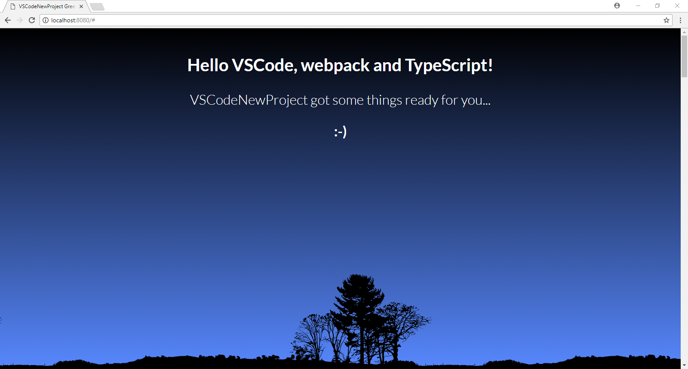

# VSCodeNewProject
Rapidly creates a new project in VSCode for local development.

My intention for this project is to get you up-and-running quick for local development and to demostrate basic web development.  This project has the webpack loaders listed below, but of course, you can add or remove any for your needs.
* css-loader
* extract-loader
* file-loader
* html-loader
* node-sass
* sass-loader
* style-loader
* ts-loader

## Prerequisites
* VSCode, Google Chrome and npm installed
* 'Debugger for Chrome' extension installed for VSCode.

## Instructions
Clone this repository, set location to project folder and install packages:
```
git clone https://github.com/marckassay/VSCodeNewProject.git
sl ./VSCodeNewProject
npm install
```

After installing, open VSCode and select:
Tasks > 'Run Task' and select '(Start) Webpack Dev Server' from the tasks list

That will start webpack's dev server.  Now just launch Chrome in a debug session:
Debug > Start Debugging

If everthing goes as intended, you should see the follow webpage:


## Feedback
Let me know if this is helpful!  Use the Issues section for questions, bugs or requests.